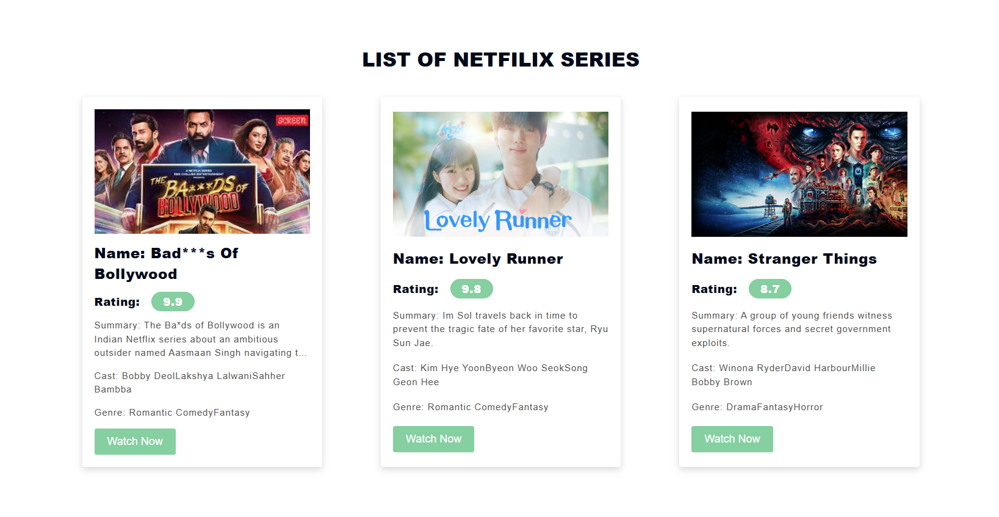

# 🎬 Netflix Cards in React

This is my first React project — a simple Netflix-style cards app that displays a list of movies or series with details like name, rating, genre, and cast.  
I built this project while learning the basics of **React.js**, including components, props, CSS styling, and data mapping.

---

## 🚀 Features

- Display movies/series using data from a JSON file  
- Each card shows:
  - Poster image  
  - Name  
  - Rating (highlighted with color based on value)  
  - Description (trimmed with ellipsis)  
  - Cast and Genre  
  - “Watch Now” button with link  
- Header and Footer components  
- Custom CSS styling for hover, buttons, and layout  

---

## 🧠 What I Learned

- Setting up a React project with **Vite**  
- Using **functional components**  
- Passing data through **props**  
- Applying **conditional rendering and classNames**  
- Organizing components and CSS files  

---

## ⚙️ Installation & Usage

1. Clone the repository:
   ```bash
   git clone https://github.com/your-username/netflix-cards-in-react.git
Navigate into the project folder:

bash
Copy code
cd netflix-cards-in-react
Install dependencies:

bash
Copy code
npm install
Run the development server:

bash
Copy code
npm run dev



netflix-cards-in-react/
│
├── public/
│
├── src/
│   ├── api/
│   │   └── seriesData.json
│   ├── components/
│   │   ├── Netflixseries.jsx
│   │   ├── seriescards.jsx
│   │   └── Netflixseries.css
│   ├── App.jsx
│   ├── index.css
│   └── main.jsx
│
└── package.json

Hunain Shahid
🌐 Frontend Developer (Learning React.js)
📧 Hunainshahid032@gmail.com